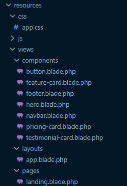
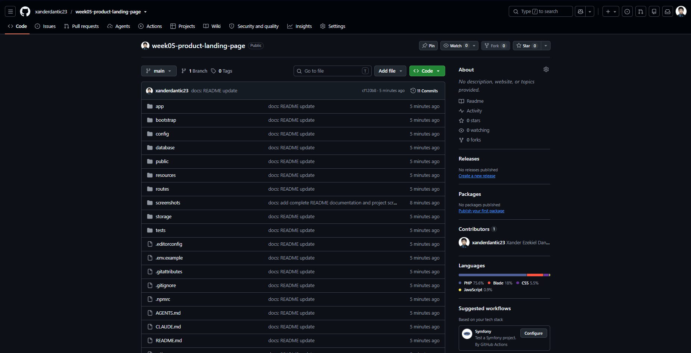
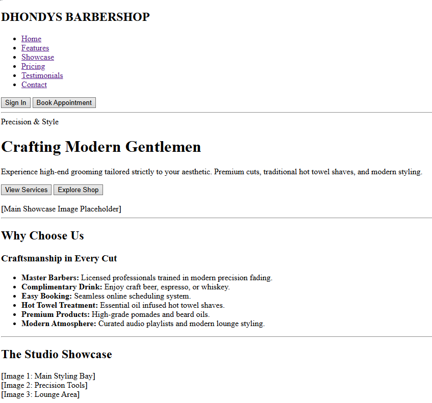
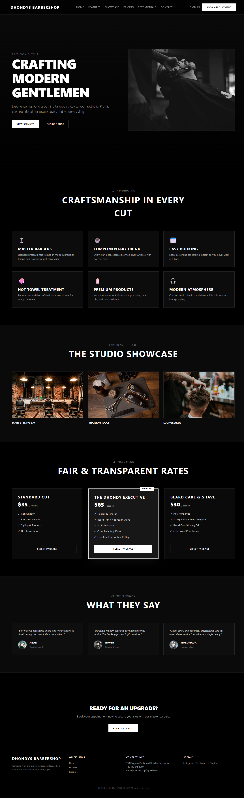

## 1. Project Title

**DHONDYS BARBERSHOP - Responsive Product Landing Page**  
*A modern, high-contrast, black-and-white responsive landing page built for **Dhondy's Barbershop** using **Laravel**, **Tailwind CSS**, and **Blade Components**.*

**Subject:** ITST 302 — Client-Server Technologies  
**Project:** Mini Project 04: Responsive Product Landing Page using Laravel, Tailwind CSS, and Blade Components 
**Course:** Bachelor of Science in Information Technology (BSIT)  

---

## 2. Introduction

* **What is a Product Landing Page?** A landing page is a standalone web page designed specifically for marketing or advertising campaigns. It serves as the initial entry point for potential clients.
* **Importance for Businesses:** For local service businesses like barbershops, a professional landing page establishes brand credibility, showcases services and transparent pricing, displays customer reviews, and drives direct client conversions/bookings.
* **Purpose of the Project:** This project transforms Dhondy's Barbershop's physical identity into a high-end, responsive online platform designed with modern UI/UX principles.

---

## 3. Learning Objectives

* Build responsive web interfaces using Tailwind CSS.
* Implement component-based frontend architecture in Laravel using Blade Components.
* Master layout inheritance using standard Laravel `layouts/app.blade.php`.
* Structure reusable UI elements such as navigation bars, cards, and buttons.
* Develop a clean, mobile-first design system with proper typographic contrast and spacing.

---

## 4. Responsive Web Design

* **Mobile-First Design:** The page layout was designed starting from mobile breakpoints up to large desktop views, ensuring fast loading times and uncompromised usability across all device types.
* **Responsive Breakpoints:** Uses Tailwind CSS breakpoints (`sm:`, `md:`, `lg:`) and custom media queries to scale typography and adjust grid columns dynamically.
* **Flexbox & CSS Grid:** Applied Flexbox (`flex`, `items-center`, `justify-between`) for navigation headers and buttons. Applied CSS Grid (`grid`, `md:grid-cols-3`) for feature lists, product showcases, pricing tiers, and testimonials.
* **User Experience (UX):** Responsive web design is critical for modern applications as a majority of users discover local businesses via mobile devices. Ensuring smooth scrolling, legible typography, and touch-friendly buttons enhances client trust and retention.

---

## 5. Tailwind CSS

* **Utility-First CSS:** Tailwind provides low-level utility classes that allow building custom, highly tailored designs directly inside markup or custom external stylesheets.
* **Advantages:** Eliminates CSS naming bloat, speeds up development time, and enforces consistent spacing and color system rules.
* **Custom Styling Setup:** Custom rules were separated into `resources/css/app.css` using standard `@import "tailwindcss";` directives and structured CSS class names (`.hero-section`, `.feature-card`, `.btn-primary`).

---

## 6. Blade Components

* **What are Blade Components?** Blade Components are self-contained, reusable custom HTML tags in Laravel (such as `<x-button>` or `<x-feature-card>`) that bundle markup, styling, and logic into single files. They allow developers to pass dynamic props and content slots without copying and pasting HTML across multiple pages.

### Why Reusable Components Improve Maintainability
* **Single Source of Truth:** Updating styling or layout logic in one component file instantly applies across all instances in the entire application without needing to manually edit multiple files.
* **Cleaner Page Views:** Page files like `landing.blade.php` remain concise, readable, and focused on high-level content structure rather than long, repetitive blocks of HTML.
* **Reduced Bug Surface Area:** Centralizing markup reduces copying/pasting errors, missing tags, or inconsistent styling classes.

### Benefits of Modular UI Development
* **Scalability:** Easily add new features or pages by reusing existing components like buttons, cards, and navigation bars.
* **Consistency:** Enforces unified branding, spacing, typography, and button styles across all device viewports.
* **Team Collaboration:** Multiple developers can work independently on separate components without causing merge conflicts on main page views.

---

### Sample Code Snippets

#### 1. Reusable Feature Card Component (`resources/views/components/feature-card.blade.php`)
```html
@props(['title', 'description', 'icon' => '✂️'])

<div class="feature-card">
    <div class="text-3xl mb-4">{{ $icon }}</div>
    <h3 class="text-xl font-bold uppercase tracking-wider text-white mb-2">{{ $title }}</h3>
    <p class="text-neutral-400 text-sm leading-relaxed">{{ $description }}</p>
</div>
```

#### 2. Reusable Button Component (`resources/views/components/button.blade.php`)
```html
@props(['type' => 'primary', 'href' => '#'])

<a href="{{ $href }}" {{ $attributes->merge(['class' =>$type === 'primary' ? 'btn-primary' : 'btn-secondary']) }}>
    {{ $slot }}
</a>
```

#### 3. Component Usage in Landing Page (`resources/views/pages/landing.blade.php`)
```html
<div class="grid md:grid-cols-3 gap-6">
    <x-feature-card 
        icon="💈" 
        title="Master Barbers" 
        description="Licensed professionals trained in modern precision fading and classic straight-razor cuts." 
    />
</div>

<x-button href="#pricing" type="primary">View Services</x-button>
```

---

## 7. User Interface Design

* **Color Palette:** High-contrast monochromatic theme using `#000000` (Pure Black), `#0a0a0a` / `#171717` (Neutral Dark Grey), and `#ffffff` (Pure White).
* **Typography:** Modern, clean sans-serif stack (`ui-sans-serif`, `system-ui`) with uppercase tracked headers (`letter-spacing: 0.1em`).
* **Iconography:** Minimalist emojis (`💈`, `☕`, `📅`, `🧼`, `🧴`, `🎧`) providing immediate visual context.
* **Button Styles:** High-contrast inverted primary buttons (white background with black text) and subtle bordered secondary buttons.
* **Card Design:** Semi-transparent dark cards (`rgba(23, 23, 23, 0.5)`) featuring subtle borders (`border-neutral-800`) and soft white border hover highlights.

---

## 8. Folder Structure

Below is an overview of the key directories in this project and their specific roles:

* **`resources/views/layouts`**
  Contains master view templates (e.g., `app.blade.php`) that establish the global HTML document structure, `<head>` tags, meta properties, CSS/JS asset references, and primary content placement via `@yield('content')` or `{{ $slot }}`.

* **`resources/views/components`**
  Houses modular, reusable Blade UI components (such as `navbar.blade.php`, `hero.blade.php`, `feature-card.blade.php`, `pricing-card.blade.php`, `testimonial-card.blade.php`, `button.blade.php`, and `footer.blade.php`). These reduce code duplication and simplify frontend maintenance.

* **`resources/views/pages`**
  Stores top-level page views (such as `landing.blade.php`) that extend the main layout and combine components to compose full application views.

* **`public`**
  The web server's public document root. Holds static assets, stylesheets, compiled scripts, and local images (including showcase photos and client avatars stored in `public/images/`).

* **`screenshots`**
  Contains visual documentation demonstrating the responsive design across Desktop, Tablet, and Mobile views, alongside individual component close-ups, VS Code folder views, and GitHub proof.

* **`documentation`**
  Stores submission assets including before-and-after visual comparisons, wireframes, and project reflection notes tracking the UI/UX design process.

---

## 9. Screenshots

| Screenshot Asset | Visual Preview |
| :--- | :---: |
| **Desktop View** |  |
| **Tablet View** |  |
| **Mobile View** |  |
| **Navigation Bar** |  |
| **Hero Section** |  |
| **Features Section** |  |
| **Pricing Section** |  |
| **Testimonials** |  |
| **Footer** |  |
| **Blade Components Folder** |  |
| **GitHub Repository** |  |

---

## 10. Before-and-After Comparison

### Visual Evolution & UI/UX Improvements

* **Before Design (Wireframe / Unstyled Layout):**
  * Basic, unstyled HTML document structure using default browser typography and black text.
  * Standard bulleted lists for features, unstyled native buttons, and plain text placeholders for image showcase sections.
  * Lack of clear visual hierarchy, color contrast, or grid layout alignment.
  


* **After Design (Final Responsive Interface):**
  * Modern, high-contrast black-and-white aesthetic built with custom Tailwind CSS utility classes.
  * Component-driven modular architecture using Laravel Blade (`<x-navbar>`, `<x-hero>`, `<x-feature-card>`, etc.).
  * Fully responsive CSS Grid and Flexbox layouts optimized across Mobile, Tablet, and Desktop viewports.
  * Integrated local photography (`public/images/`) and clean typography with uppercase tracked headings for an elevated brand identity.

