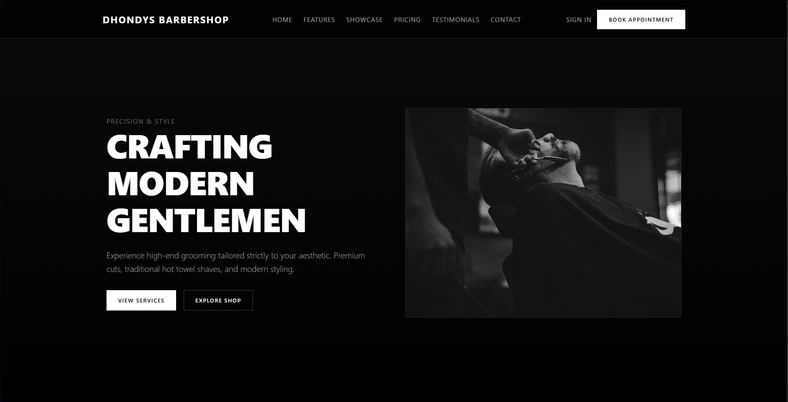
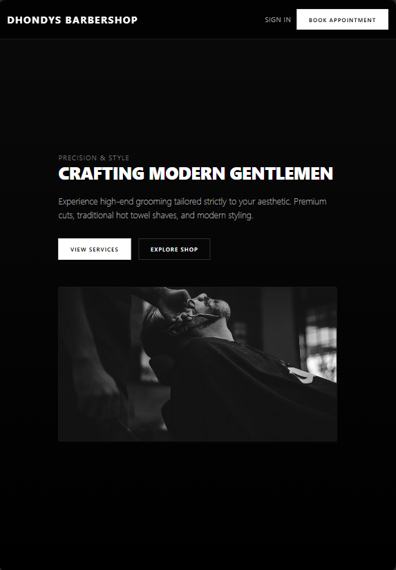
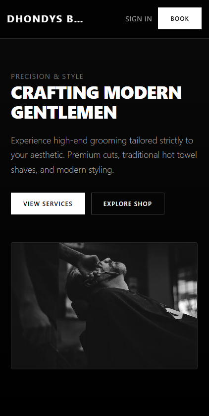
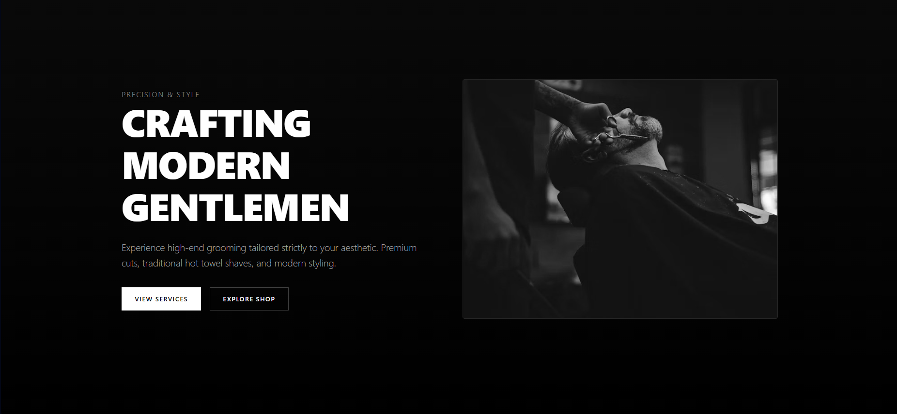
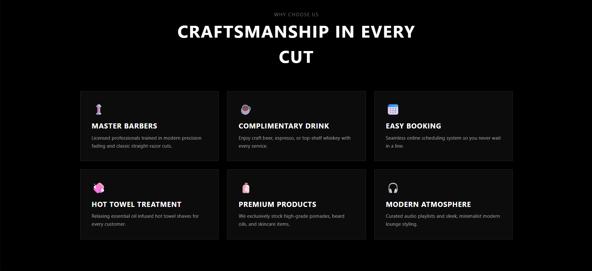
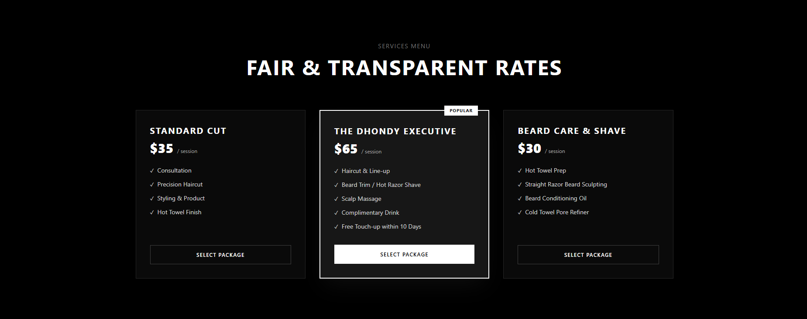
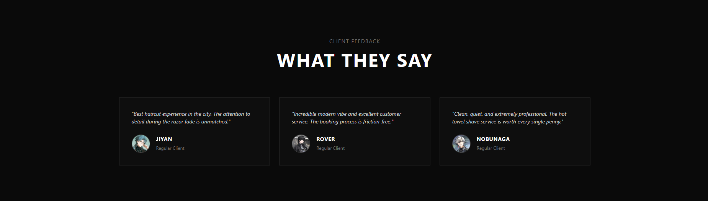

## 1. Project Title

**DHONDYS BARBERSHOP - Responsive Product Landing Page**  
*A modern, high-contrast, black-and-white responsive landing page built for **Dhondy's Barbershop** using **Laravel**, **Tailwind CSS**, and **Blade Components**.*

**Subject:** ITST 302 — Client-Server Technologies  
**Project:** Mini Project 04: Responsive Product Landing Page using Laravel, Tailwind CSS, and Blade Components 
**Course:** Bachelor of Science in Information Technology (BSIT)  

---

## 2. Introduction

* **What is a Product Landing Page?** A landing page is a standalone web page designed specifically for marketing or advertising campaigns. It serves as the initial entry point for potential clients.
* **Importance for Businesses:** For local service businesses like barbershops, a professional landing page establishes brand credibility, showcases services and transparent pricing, displays customer reviews, and drives direct client conversions/bookings.
* **Purpose of the Project:** This project transforms Dhondy's Barbershop's physical identity into a high-end, responsive online platform designed with modern UI/UX principles.

---

## 3. Learning Objectives

* Build responsive web interfaces using Tailwind CSS.
* Implement component-based frontend architecture in Laravel using Blade Components.
* Master layout inheritance using standard Laravel `layouts/app.blade.php`.
* Structure reusable UI elements such as navigation bars, cards, and buttons.
* Develop a clean, mobile-first design system with proper typographic contrast and spacing.

---

## 4. Responsive Web Design

* **Mobile-First Design:** The page layout was designed starting from mobile breakpoints up to large desktop views, ensuring fast loading times and uncompromised usability across all device types.
* **Responsive Breakpoints:** Uses Tailwind CSS breakpoints (`sm:`, `md:`, `lg:`) and custom media queries to scale typography and adjust grid columns dynamically.
* **Flexbox & CSS Grid:** Applied Flexbox (`flex`, `items-center`, `justify-between`) for navigation headers and buttons. Applied CSS Grid (`grid`, `md:grid-cols-3`) for feature lists, product showcases, pricing tiers, and testimonials.
* **User Experience (UX):** Responsive web design is critical for modern applications as a majority of users discover local businesses via mobile devices. Ensuring smooth scrolling, legible typography, and touch-friendly buttons enhances client trust and retention.

---

## 5. Tailwind CSS

* **Utility-First CSS:** Tailwind provides low-level utility classes that allow building custom, highly tailored designs directly inside markup or custom external stylesheets.
* **Advantages:** Eliminates CSS naming bloat, speeds up development time, and enforces consistent spacing and color system rules.
* **Custom Styling Setup:** Custom rules were separated into `resources/css/app.css` using standard `@import "tailwindcss";` directives and structured CSS class names (`.hero-section`, `.feature-card`, `.btn-primary`).

---

## 6. Blade Components

Blade Components allow breaking UI elements into modular, reusable blocks to eliminate code duplication and maintain frontend cleanliness.

### Component Architecture
* `resources/views/layouts/app.blade.php` - Main global layout wrapper.
* `resources/views/components/navbar.blade.php` - Sticky navigation header.
* `resources/views/components/hero.blade.php` - Brand intro section.
* `resources/views/components/feature-card.blade.php` - Reusable service/feature card.
* `resources/views/components/pricing-card.blade.php` - Package pricing tier card.
* `resources/views/components/testimonial-card.blade.php` - Customer review card.
* `resources/views/components/button.blade.php` - Primary/secondary CTA button.
* `resources/views/components/footer.blade.php` - Brand details, links, and contact section.

---

## 7. User Interface Design

* **Color Palette:** High-contrast monochromatic theme using `#000000` (Pure Black), `#0a0a0a` / `#171717` (Neutral Dark Grey), and `#ffffff` (Pure White).
* **Typography:** Modern, clean sans-serif stack (`ui-sans-serif`, `system-ui`) with uppercase tracked headers (`letter-spacing: 0.1em`).
* **Iconography:** Minimalist emojis (`💈`, `☕`, `📅`, `🧼`, `🧴`, `🎧`) providing immediate visual context.
* **Button Styles:** High-contrast inverted primary buttons (white background with black text) and subtle bordered secondary buttons.
* **Card Design:** Semi-transparent dark cards (`rgba(23, 23, 23, 0.5)`) featuring subtle borders (`border-neutral-800`) and soft white border hover highlights.

---

## 8. Folder Structure

* **resources/views/layouts**
* **resources/views/components**
* **resources/views/pages** 
* **public**
* **screenshots** 
* **documentation**  

## 9. Screenshots

| Screenshot Asset | Visual Preview |
| :--- | :---: |
| **Desktop View** |  |
| **Tablet View** |  |
| **Mobile View** |  |
| **Navigation Bar** |  |
| **Hero Section** |  |
| **Features Section** |  |
| **Pricing Section** |  |
| **Testimonials** |  |
| **Footer** |  |
| **Blade Components Folder** |  |
| **GitHub Repository** |  |